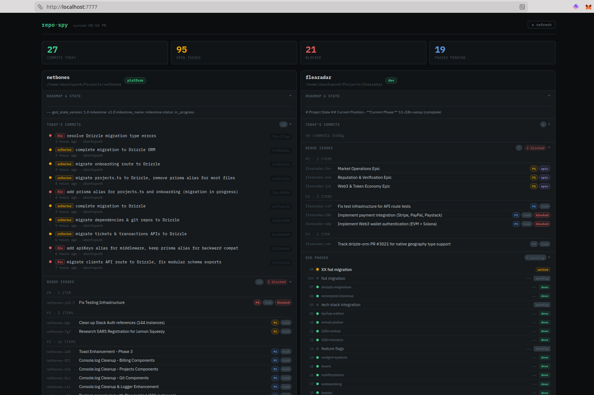

# repo-spy

A bash script that collects overview data from multiple repositories, providing insights into daily commits, issues, and GSD planning progress.



## Features

- **Daily Commits**: Collects all git commits from the current day across repositories
- **Current Branch**: Shows the active branch for each repository
- **Issue Tracking**: Integrates with beads (`bd`) for issue management data
- **GSD Planning Overview**: Provides detailed progress tracking for Get Shit Done (GSD) planning phases
  - Phase completion status based on SUMMARY.md files
  - Last completed phase and next phase identification
  - Phase descriptions and todo counts
  - Roadmap sections for last completed and next plans

## Install

```bash
git clone <repo-url> && cd repo-spy
./install.sh
```

This installs two commands to `~/.local/bin`:

| Command | What it does |
|---|---|
| `repo-spy` | Collect data from configured repos → `~/.repo-spy/data.json` |
| `repo-spy-dashboard` | Collect + serve the dashboard on `http://localhost:7777` |

## Usage

**Quick start:**

```bash
repo-spy-dashboard
```

This collects fresh data and serves the dashboard. Opens your browser automatically.

**Collect only:**

```bash
repo-spy
```

## Configuration

Edit `~/.repo-spy/config` — one repo path per line, `#` comments supported:

```
$HOME/Projects/my-repo
$HOME/Projects/another-repo
# $HOME/Projects/archived-repo
```

Environment variables like `$HOME` are expanded automatically.

**Custom port:**

```bash
REPO_SPY_PORT=8888 repo-spy-dashboard
```

## Output Format

The script generates a JSON file with the following structure:

```json
{
  "repos": [
    {
      "name": "repository-name",
      "dir": "/path/to/repo",
      "branch": "main",
      "commits": [
        {
          "hash": "abc123",
          "msg": "Fix bug",
          "time": "2 hours ago",
          "author": "John Doe"
        }
      ],
      "issues": [...], // Beads issues data
      "planning_phases": [
        {
          "number": "00",
          "name": "multi-tenant-foundation",
          "completed": true,
          "description": "Set up multi-tenant architecture"
        }
      ],
      "planning_todos": 5,
      "planning_state": "Current planning state summary",
      "last_completed_phase": "multi-tenant-foundation",
      "next_phase": "enforcement",
      "planning_last_completed_plan": "Details from ROADMAP.md",
      "planning_next_plan": "Upcoming plan details"
    }
  ],
  "synced": "2026-04-23T21:00:08+02:00"
}
```

## GSD Planning Integration

For repositories with a `.planning` directory (GSD planning structure), the script provides:

- **Phase Details**: Name, number, completion status, and description for each phase
- **Progress Tracking**: Automatically identifies the last completed phase and next phase
- **Todo Count**: Number of pending todos
- **State Summary**: Current planning state
- **Roadmap Sections**: Extracts "Last Completed Plan" and "Next Plan" from ROADMAP.md

## Dependencies

- `git`: For commit data
- `jq`: For JSON processing
- `find`, `sed`, `head`: Standard Unix tools

## License

GPL-3.0 License

